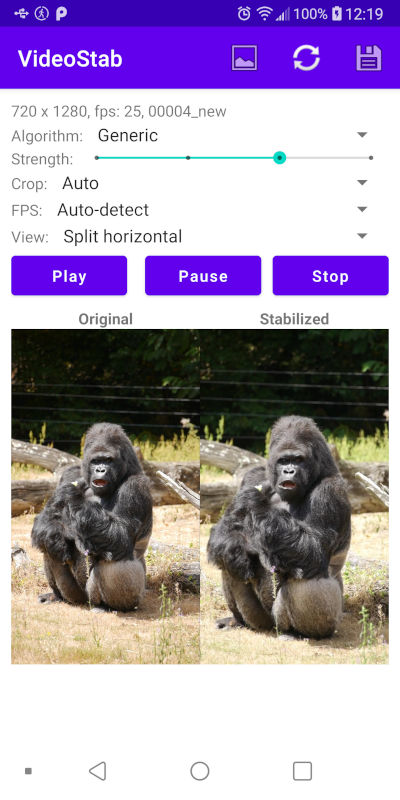
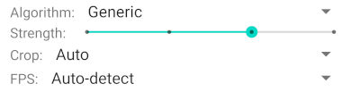

# VideoStab

A simple video stabilisation for Android, based on:
* https://learnopencv.com/video-stabilization-using-point-feature-matching-in-opencv/
* https://github.com/spmallick/learnopencv/tree/master/VideoStabilization

WARNING:
* Work is still in progress

Output video format:
* Use MPEG4 encoder and try to get the best quality

# How it works

## Analyse step

It tries to detect the transformations between two consecutive frames: transition (X and Y) and rotation.
Using this values it calculates a trajectory: for each frame it calculates the transition and rotation compared to the first frame.

## Stabilisation

Using the trajectory, for each axe (X, Y, rotations) it will apply one of this algorithms:
* none: keep values unchanged
* reverse: tries to apply the reverse changes to put the frame in the same "position" as the first one
* moving average: it will smooth the changes
* distribute: it will evenly distribute the change between the first and the last frame (panning)

Algorithm | X transformation | Y transformation | Rotation transformation
-- | -- | -- | --
Generic | moving average | moving average | moving average
Generic (B) | moving average | moving average | reverse
Still | reverse | reverse | reverse
Horizontal panning | distribute | reverse | reverse
Horizontal panning (B) | distribute | reverse | moving average
Vertical panning | reverse | distribute | reverse
Vertical panning (B) | reverse | distribute | moving average
Panning | distribute | distribute | reverse
Panning (B) | distribute | distribute | moving average
No rotation | none | none | reverse

# Interface

## Menu

Icon | Description
--- | ---
 | Open a video file
 | Apply the stabilisation using the current parameters
 | Save the current stabilized video

## Input video informations

* Resolution (720x1280)
* Auto-detected FPS (25). NOTE: can be wrong in some cases
* File name ("00004_new")

## Stabilisation parameters

 | Save the current stabilized video

* Algorithm: see "How it works" section for more details
* Strength: seconds to be used for moving average window (1, 2, 3 or 4 seconds)
* Crop: because the frames can be moved and rorated you can have black regions. This can be cropped (Auto, 0%, 5%, 10%)
* FPS: you can for a specific FPS if the auto detection failes

## View

You can see the original, stabilized or both (horizontal or vertical split) videos at the same time.

# Examples

See the original vs stabilized video.

## Original vs Generic
https://user-images.githubusercontent.com/7062741/186948791-aaa36028-4838-4819-af13-e943bacb7746.mp4

## Original vs Still
https://user-images.githubusercontent.com/7062741/186948936-8897cbe2-3485-4d68-b86c-f6e74cec0487.mp4

## Original vs Horizontal panning
https://user-images.githubusercontent.com/7062741/186948982-52f177b9-876d-4af1-87cf-397f3860d3e0.mp4

## Original vs Vertical panning
https://user-images.githubusercontent.com/7062741/186949010-35b108d3-bb15-4303-8da3-e838687b6474.mp4

## Original vs Panning
https://user-images.githubusercontent.com/7062741/186949026-6c30e8ef-572f-440a-bff1-12ad6493a987.mp4

# ToDo

* Use ffmpeg to copy the audio from the original video
