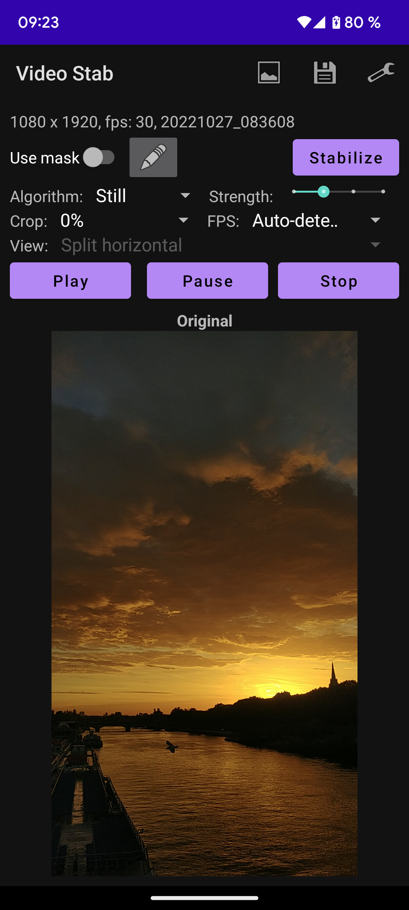
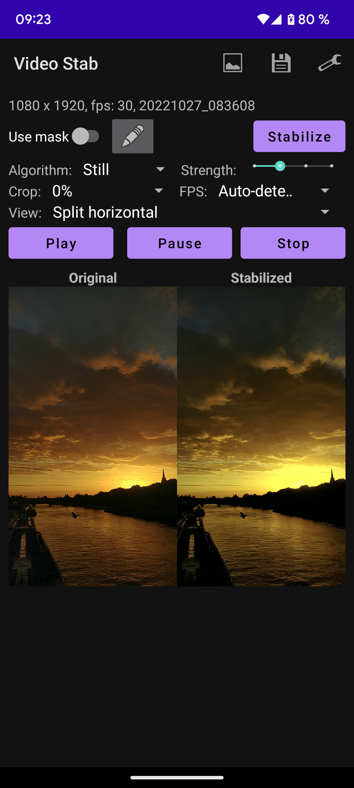
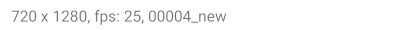
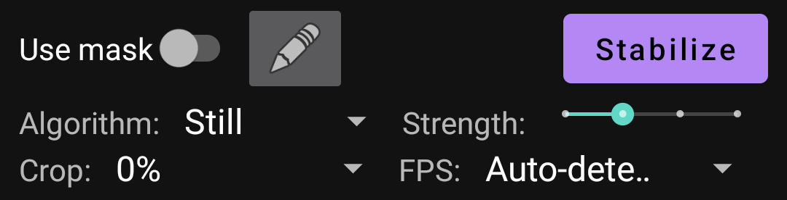

# VideoStab

A simple video stabilisation for Android, based on:
* https://learnopencv.com/video-stabilization-using-point-feature-matching-in-opencv/
* https://github.com/spmallick/learnopencv/tree/master/VideoStabilization

# How it works

## Analyse step

It tries to detect the transformations between two consecutive frames: transition (X and Y) and rotation.
Using this values it calculates a trajectory: for each frame it calculates the transition and rotation compared to the first frame.

## Stabilisation

Using the trajectory, for each axe (X, Y, rotations) it will apply one of this algorithms:
* none: keep values unchanged
* reverse: tries to apply the reverse changes to put the frame in the same "position" as the first one
* moving average: it will smooth the changes
* distribute: it will evenly distribute the change between the first and the last frame (panning)

Algorithm | X transformation | Y transformation | Rotation transformation
-- | -- | -- | --
Generic | moving average | moving average | moving average
Generic (B) | moving average | moving average | reverse
Still | reverse | reverse | reverse
Horizontal panning | distribute | reverse | reverse
Horizontal panning (B) | distribute | reverse | moving average
Vertical panning | reverse | distribute | reverse
Vertical panning (B) | reverse | distribute | moving average
Panning | distribute | distribute | reverse
Panning (B) | distribute | distribute | moving average
No rotation | none | none | reverse

# Interface
lBefore stabilisation | After stabilisation
--- | ---
 | 

## Menu

Icon | Description
--- | ---
 | Open a video file
 | Save the current stabilized video
 | Application settings

## Input video informations

* Resolution
* Auto-detected FPS. NOTE: can be wrong in some cases
* File name

## Stabilisation parameters

* Use mask / edit mask: useful for difficult scenarios (see Mask section)
* Stabilize button: you need to press it to update the stabilisation (it's to slow to be updated automaticaly at every change)
* Algorithm: see "How it works" section for more details
* Strength: seconds to be used for moving average window (1, 2, 3 or 4 seconds)
* Crop: because the frames can be moved and rorated you can have black regions. This can be cropped (Auto, 0%, 5%, 10%)
* FPS: you can for a specific FPS if the auto detection failes

## View

You can see the original, stabilized or both (horizontal or vertical split) videos at the same time.

## Mask

Some video have big moving element (like big clouds) that can false frame alignemnt.

This screen allow to draw a mask for the first frame that specify items that suppose to be still.

The light part is the mask.
You can clear the mask, fill (all pixels are used) and you can draw / erase.
To draw / erase you must press and keep hold one of the buttons and with another edit the mask.

See thre result: original (left), still without mask (middle) and still with the mask (right).

https://user-images.githubusercontent.com/7062741/212324215-013dbb22-1a26-42d4-9599-19d6a87e3fa3.mp4

# Examples

See the original vs stabilized video.

## Original vs Generic
https://user-images.githubusercontent.com/7062741/186948791-aaa36028-4838-4819-af13-e943bacb7746.mp4

## Original vs Still
https://user-images.githubusercontent.com/7062741/186948936-8897cbe2-3485-4d68-b86c-f6e74cec0487.mp4

## Original vs Horizontal panning
https://user-images.githubusercontent.com/7062741/186948982-52f177b9-876d-4af1-87cf-397f3860d3e0.mp4

## Original vs Vertical panning
https://user-images.githubusercontent.com/7062741/186949010-35b108d3-bb15-4303-8da3-e838687b6474.mp4

## Original vs Panning
https://user-images.githubusercontent.com/7062741/186949026-6c30e8ef-572f-440a-bff1-12ad6493a987.mp4

# ToDo

* Try to copy the audio from the original video
