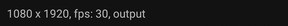
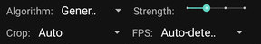

# VideoStab

A simple video stabilisation for Android, based on:
* https://learnopencv.com/video-stabilization-using-point-feature-matching-in-opencv/
* https://github.com/spmallick/learnopencv/tree/master/VideoStabilization

# How it works

## Analyse step

It tries to detect the transformations between two consecutive frames: transition (X and Y) and rotation.
Using this values it calculates a trajectory: for each frame it calculates the transition and rotation compared to the first frame.

## Stabilisation

Using the trajectory, for each axe (X, Y, rotation) it will apply one of this algorithms:
* none: keep values unchanged
* reverse: tries to apply the reverse changes to put the frame in the same "position" as the first one
* moving average: it will smooth the changes
* distribute: it will evenly distribute the change between the first and the last frame (panning)

Algorithm | X transformation | Y transformation | Rotation transformation
-- | -- | -- | --
Generic | moving average | moving average | moving average
Generic (B) | moving average | moving average | reverse
Still | reverse | reverse | reverse
Horizontal panning | distribute | reverse | reverse
Horizontal panning (B) | distribute | reverse | moving average
Vertical panning | reverse | distribute | reverse
Vertical panning (B) | reverse | distribute | moving average
Panning | distribute | distribute | reverse
Panning (B) | distribute | distribute | moving average
No rotation | none | none | reverse

# Interface

## Toolbar

In order;
* Open a video file
* Save the current stabilized video
* Settings
* ... allow to open a series of images or an images folder (that will be considered as a video)

## Input video informations

* Resolution
* Auto-detected FPS. NOTE: can be wrong in some cases
* File name

## Stabilisation parameters

* Algorithm: see "How it works" section for more details
* Strength: seconds to be used for moving average window (1, 2, 3 or 4 seconds)
* Crop: because the frames can be moved and rorated you can have black regions. This can be cropped (Auto, 0%, 5%, 10%)
* FPS: you can for a specific FPS if the auto detection failes

## Media

In order:
* Play original video
* Play stabilized video (it will apply the stabilisation if needed)
* Stop the player
* Edit stabilisation mask (used only for "Still" algorithm)

## Mask

Some video have big moving element (like big clouds) that can false frame alignemnt.

This screen allow to draw a mask for the first frame that specify items that suppose to be still.

The light part is the mask.
You can clear the mask, fill (all pixels are used) and you can draw / erase.
To draw / erase you must press and keep hold one of the buttons and with another edit the mask.

See thre result: original (left), still without mask (middle) and still with the mask (right).

# Examples

See the original vs stabilized video.

## Original vs Generic

## Original vs Still

## Original vs Horizontal panning

## Original vs Vertical panning

## Original vs Panning

